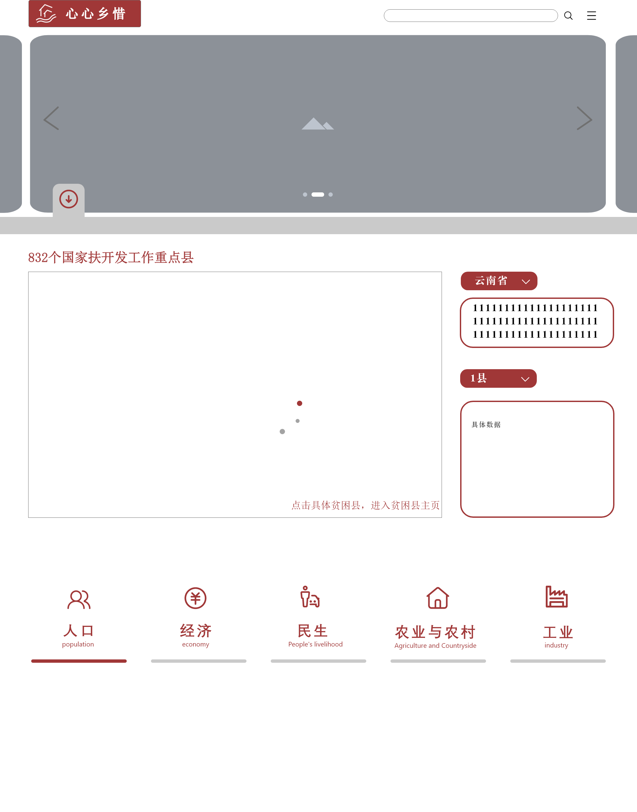

# 心心”乡“惜项目

## Run Project
### Project setup
```
npm install
```

### Compiles and hot-reloads for development
```
npm run serve
```

### Compiles and minifies for production
```
npm run build
```

## 参考UI

## Component Description
- NavigationBar 导航栏
- BackgroundPic 背景图片
- Home 暂时未使用 api见`router/index.js`
- HomePage 首页
- AsideBar 暂未使用
- BodyMap 地图（已完成各省市扶贫地图，未完成具体贫困县）
- GitHubCorner 暂未使用
- Footer 首页的footer 暂未使用

## 🤩Finished
- BodyMap的各省市扶贫县数量和轮播显示（已连接后端，数据库还在完善）
- HomePage导航栏吸顶显示

## 👊Unfinished
- 首页的导航栏子菜单显示，icon添加
- 首页头部 标志和搜索栏的浮于背景图
- 首页插入地图
- 首页绘制地图右边的简介
- 首页Footer
- 县详情页可视化

